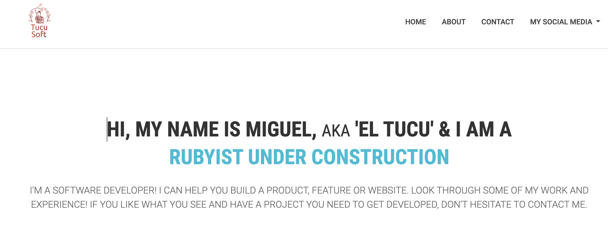

## My personal portfolio

> In this webpage you'll be able to see my projects

## Live Demo

Visit [My portfolio](https://miguelargentina.github.io/portfolio/)!

## Features

- This portfolio will be constantly updated in order to add my most recent projects

## Screenshot

## Built With

- html5
- css3
- javascript

## Author

### Miguel Gomez

* GitHub: [@MiguelArgentina](https://github.com/MiguelArgentina)
* twitter - https://twitter.com/Qete_arg

### Acknowledgments

- Design based on this [template](https://www.figma.com/file/t3EJUCAEViw3QasuJLPLVT/Microverse-Student-Potfolio-Templates-Main?node-id=0%3A1) by [Microverse](https://www.microverse.org)

### 🤝 Contributing

Contributions, issues, and feature requests are welcome!

Feel free to check the [issues page](https://github.com/MiguelArgentina/portfolio/issues).

### Show your support

Give a ⭐️ if you like this project!

### 📝 License

This project is [MIT](License) licensed.
